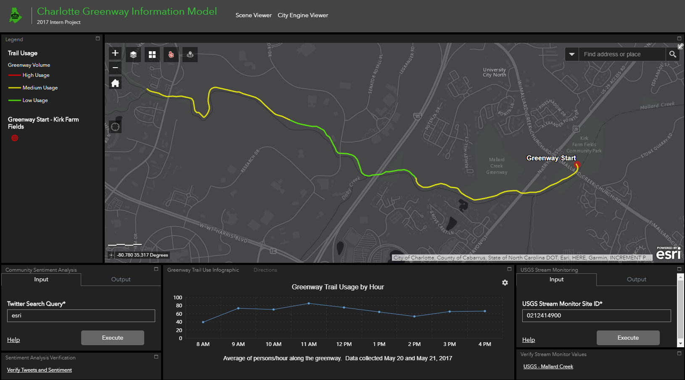

# ArcGISserver-geoprocessing-services
This repo includes Geoprocessing Services published to ArcGIS Server for use in an Esri Web Application that was developed for the <a href="http://ess.maps.arcgis.com/apps/webappviewer/index.html?id=50c3402cea314254b0588d5c20238d4f">2017 Summer Intern Project</a> in Charlotte, NC.  
 
##Geoprocessing Services:  
Twitter API sentiment analysis 
USGS Stream Monitoring 
Yelp Rating Retrieval 
 

