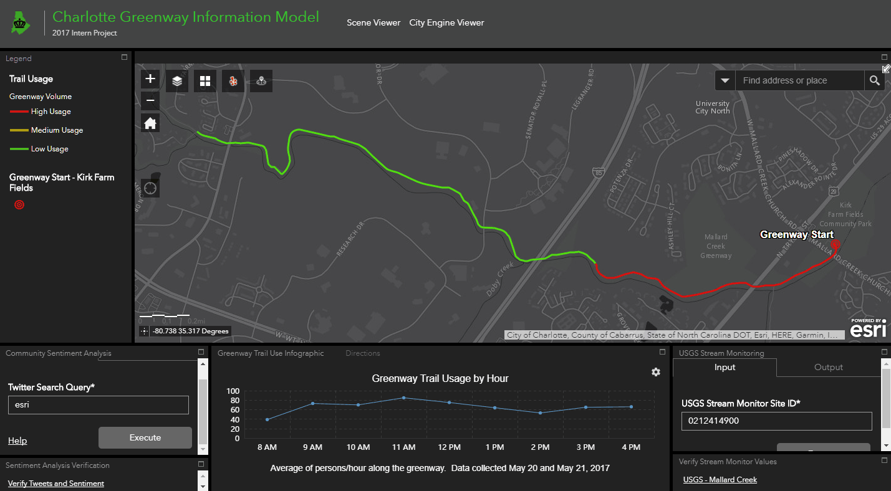

# Twitter Sentiment Analysis Geoprocessing Service
</img>


<br><br>
## Overview
This geoprocessing tool can be exposed through a Geoprocessing Service on an ArcGIS Server.  As a proof of concept, this module uses the <a href="https://textblob.readthedocs.io/en/dev/" target="_blank">TextBlob library and methodology</a> for sentiment analysis, but <a href="https://cloud.google.com/natural-language/" target="_blank">more advanced</a> NLP libraries and methodologies can be used. 
<br>
<br>
The user passes in a string of text to be queried against the Twitter API and each tweet is parsed for analysis with TextBlob.  A <a href="http://tghays.github.io/twitter_verification.html" target="_blank">simple HTML page and table</a> is dynamically created each time the tool is run and displays request meta-data and each tweet with the calculated sentiment polarity.
<br>
<br>
## Usage
The user first authenticates themself with the Twitter API using the <a href="https://github.com/bear/python-twitter">Python-Twitter library</a>:

```python
consumer_key = 'consumer_key'
consumer_secret = 'consumer_secret'

access_token_key = 'access_token_key'
access_token_secret = 'access_token_secret'

api = Api(consumer_key=consumer_key,
                  consumer_secret=consumer_secret,
                  access_token_key=access_token_key,
                  access_token_secret=access_token_secret)
```
<br>
The <a href="https://github.com/Esri/developer-support/tree/master/python/arcpy-python">ArcPy module</a> is used to retrieve input from the user and construct a URL query to be passed into the Twitter Search API:

```python
query = arcpy.GetParameterAsText(0)
if len(query) > 1:
    urlQuery = query.replace(' ', '%20')
else:
    urlQuery = query

results = api.GetSearch(raw_query="q={0}&count=300".format(urlQuery))
```
